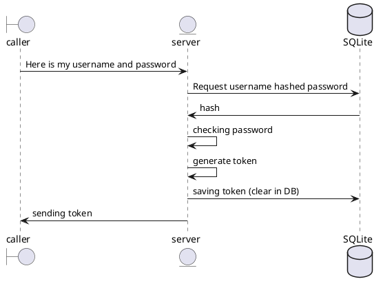
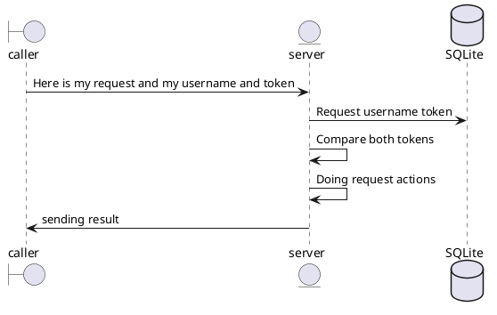

# Auth

## Get connexion token

```plantuml
@startuml
boundary caller
entity server
database SQLite
caller -> server : Here is my username and password
server -> SQLite : Request username hashed password
SQLite -> server : hash
server -> server : checking password
server -> server : generate token
server -> SQLite : saving token (clear in DB)
server -> caller : sending token
@enduml
```

## Send request

```plantuml
@startuml
boundary caller
entity server
database SQLite
caller -> server : Here is my request and my username and token
server -> SQLite : Request username token
server -> server : Compare both tokens
server -> server : Doing request actions
server -> caller : sending result
@enduml
```

## Fonct

```plantuml
@startuml
start

@enduml
```
